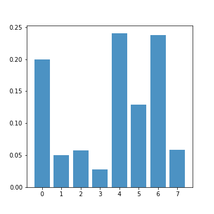
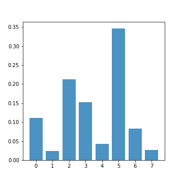
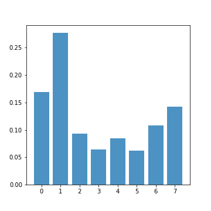

# Markov Recurrent Neural Network for sequential MNIST
In this project, we implement Markov Recurrent Neural Network (MRNN) for sequential MNIST (row by row).

Markov recurrent neural network (MRNN) explore the stochastic transitions in recurrent neural networks by incorporating the Markov property with discrete random variables. This model was proposed to deal with highly structured sequential data with complicated latent information. The discrete samples are drawn from the parameterized categorical distribution at each time step, and latent information is encoded by different state encoders depends on which state is selected.

## Setting
- Hardware:
	- CPU: Intel Core i7-4930K @3.40 GHz
	- RAM: 64 GB DDR3-1600
	- GPU: GeForce GTX 1080ti
- Tensorflow 1.4.1
- Dataset
	- MNIST

## Result
- Statistic of utilized states

||||
|:--------------------------------------------:|:----------------------------------------:|:----------------------------------------:|
|Maximum likelihood estimation|Variational Bayes|Entropy regularization|
